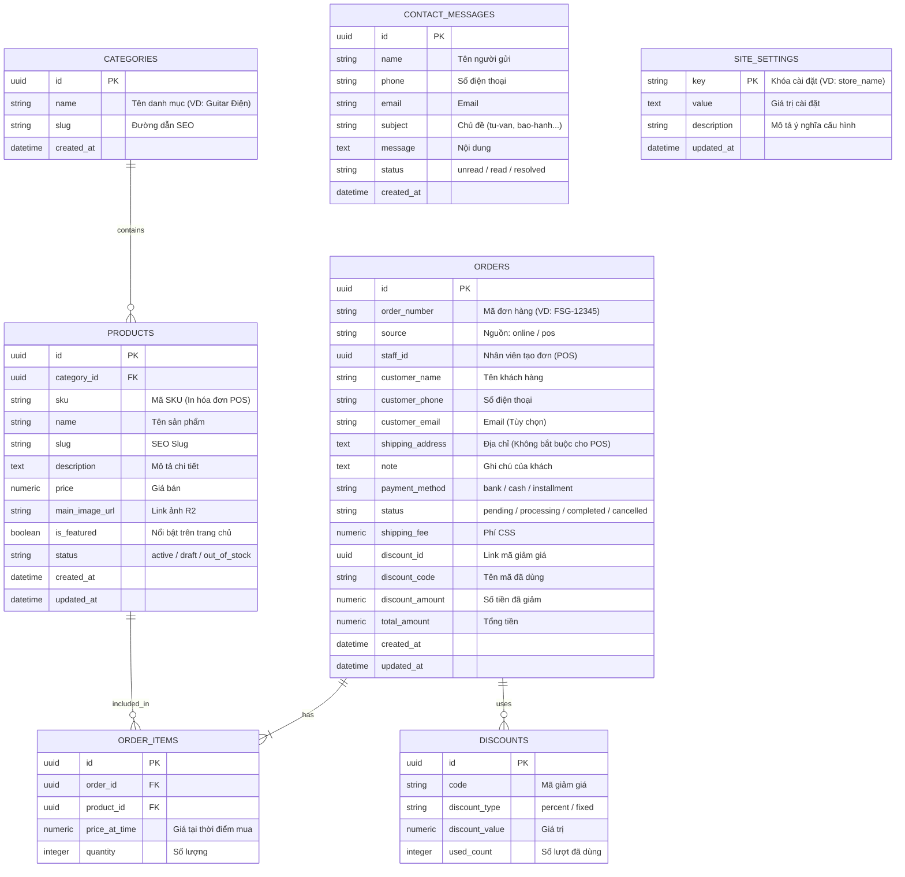

# Thiết kế Cơ Sở Dữ Liệu (Database Schema) - FlySky Guitar

Dựa trên luồng mua hàng Guest Checkout (Không bắt buộc tạo tài khoản) và các tính năng hiện có, dưới đây là sơ đồ và cấu trúc cơ sở dữ liệu được thiết kế tối ưu cho Supabase (PostgreSQL).

## 1. Sơ đồ Thực thể Liên kết (ER Diagram)

Dưới đây là sơ đồ tổng quan về các bảng và mối quan hệ giữa chúng:



## 2. Chi tiết các bảng (Tables)

### Bảng `site_settings` (Cài đặt hệ thống)
Chuyển việc lưu cài đặt từ trình duyệt (localStorage) lên thẳng máy chủ.
- `key`: Khóa định danh duy nhất (VD: `flysky_storeName`, `flysky_heroH1`).
- `value`: Giá trị hiển thị.
- Ưu điểm: Đổi xong thì mở máy tính hay điện thoại nào cũng thấy web đổi ngay lập tức, Admin không bị trói buộc với trình duyệt trên 1 máy tính.

### Bảng `categories` (Danh mục)
Dùng để phân loại nhạc cụ (Guitar điện, Acoustic, Bass, Phụ kiện...).
- `id`: UUID (Mặc định tự động tạo `gen_random_uuid()`)
- `name`: Tên hiển thị.
- `slug`: Đường dẫn không dấu (Unique).

### Bảng `products` (Sản phẩm)
Quản lý thông tin đàn và nhạc cụ.
- `category_id`: Trỏ đến bảng `categories`.
- `slug`: (Unique) Dùng để tạo link URL cực đẹp dạng `/shop/fender-stratocaster`.
- `main_image_url`: Sẽ lưu chuỗi URL ảnh công khai trả về từ hệ thống Cloudflare R2 sau khi admin upload.

### Bảng `orders` (Đơn đặt hàng lưới) / `order_items` (Chi tiết đơn)
- `status`: Quản lý tiến trình xử lý đơn hàng bởi Admin.

### Bảng `contact_messages` (Tin nhắn liên hệ)

## 3. Hệ thống Đăng nhập (Authentication)

Đúng như anh nói, **Supabase hỗ trợ Đăng nhập cực kỳ chuyên nghiệp (Auth) mà chúng ta KHÔNG CẦN TỰ TẠO BẢNG USERS.**

Supabase quản lý một Schema độc lập có tên là `auth`, trong đó luôn chứa sẵn một bảng an toàn đằng sau hậu trường là `auth.users`. Luồng hoạt động cho trang Admin sẽ như sau:
1. **Bước 1:** Mình dùng hàm `supabase.auth.signInWithPassword({ email, password })` trực tiếp bằng JS.
2. **Bước 2:** Đăng nhập thành công, hệ thống tự động lưu Session an toàn vào Cookies của trình duyệt.
3. **Bước 3:** Lát nữa khi code file Admin Layout, em sẽ kích hoạt chức năng kiểm tra của Vercel SSR để bảo vệ đường dẫn `/admin/*`. Ai chưa đăng nhập sẽ bị đá văng ra `/admin/login` ngay lập tức!

## 4. Các luồng Triggers (Tự động hóa Database)

Supabase hỗ trợ PostgreSQL rất mạnh, ta sẽ cần tạo một function và trigger để tự động cập nhật thời gian mỗi khi có sự thay đổi dữ liệu (rất quan trọng cho Admin biết bài đăng sửa lần cuối khi nào).

**Function `handle_updated_at`:**
```sql
create extension if not exists moddatetime schema extensions;

-- Function này sẽ tự động gán thời gian hiện tại vào cột updated_at
create or replace function public.handle_updated_at()
returns trigger as $$
begin
  new.updated_at = now();
  return new;
end;
$$ language plpgsql;
```

**Gắn Triggers vào các bảng tương ứng:**
```sql
-- Trigger cho bảng Products
create trigger handle_updated_at_products
  before update on public.products
  for each row execute procedure public.handle_updated_at();

-- Trigger cho bảng Orders
create trigger handle_updated_at_orders
  before update on public.orders
  for each row execute procedure public.handle_updated_at();
```

## 4. Bảo mật Dữ liệu (Row Level Security - RLS)

Vì chúng ta đang code ứng dụng có trang Admin tĩnh kết hợp Client-side, RLS trên Supabase là cách tốt nhất để bảo vệ Data:
- **Products / Categories:** `SELECT` (Ai cũng xem được), `INSERT/UPDATE/DELETE` (Chỉ cho phép tài khoản Admin thực hiện).
- **Orders / Contact Messages:** `INSERT` (Ai cũng có thể gửi đơn hàng/liên hệ), `SELECT/UPDATE/DELETE` (Chỉ Admin mới có quyền xem và đổi trạng thái).

## 5. Các Triggers Tự Động Hóa (Cập Nhật Thêm)

Đã bổ sung các Triggers cho quy trình POS và Bán hàng:
- `trigger_deduct_inventory`: Trừ sản phẩm (`products.stock_quantity`) ngay sau khi chi tiết đơn hàng được lưu.
- `trigger_restore_inventory`: Cộng lại tồn kho nếu Admin thay đổi trạng thái hóa đơn (`orders`) sang `cancelled`.
- `trigger_increment_discount`: Tăng lượt đếm số người đã dùng (`discounts.used_count`) khi đơn được tạo có đính kèm `discount_id`.
